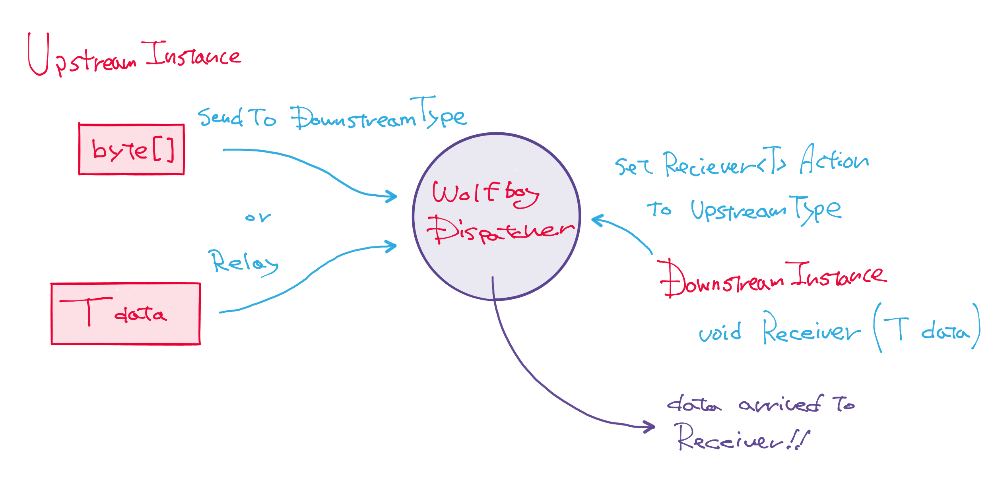

# WolfboyDispatcher

ver 1.1.0



dataType : baseType というデータ型があるときに、upstreamからdownstreamへと、
**受取手の型の指定をしつつ、流すデータの型特定をせずに、**
データを流すことができるディスパッチャ。

## From upstream
data -> Dispatcher -> SendTo(byte[], DOWNSTREAM\_TARGET_TYPE)

    アップストリームからはディスパッチャ経由で特定のクラスに対してデータを流す
    (特にデータ型を指定せず流せる)

## To downstream(DOWNSTREAM_TARGET_TYPE)
Dispatcher <- SetReceiver(ReceiverMethod\<dataType\>)

    ダウンストリームは自身がもっているメソッドを
    「特定のdataTypeを受け取るハンドラ」として登録する

こうすることで、上流からはデータを受け取って欲しいクラスだけを指定してよく分からないデータを送付し、

下流ではセットしたReceiverが受け取れる型のデータだけが届く、というメッセージングの仕組み。

また、型指定によって下流もすぐさま別の下流への上流として振る舞うことができる。


## Simple case
次のコードで、upstream classから、downstream classへと、byte[]を送ることができる。
downstream側では、byte[]が特定の型(この場合**Message1**型)だった場合のみ、データを受け取る。


```C#
// in upstream class,

// send data(byte[]) from upstream to downstream.
Dispatchers<MessageBase>.DispatchRoute<SourceEmitter>().SendTo(data, typeof(WantToReceiveMessage1));


// in downstream class,

// receive specific typed data at downstream.
Dispatchers<MessageBase>.DispatchRoute<SourceEmitter>().SetReceiver<Message1>(ReceiveMessage1);

void ReceiveMessage1 (Message1 deserializedData) {
	// deserialized data received!
}
```
送信する側は送付するデータの型を分別せずに対象を指定して送付することができ、
受信する側はデータが特定の型だった場合のみ、型を指定して受け取ることができる。

また、送付にしも受け取りにも、インスタンスの指定は一切ない。型の指定があるのみ。


## Multi Target Dispatch
複数のターゲット型に対してあるデータを投げることができる。

```C#
// in upstream class,

// send data(byte[]) from upstream to downstream x N.
Dispatchers<MessageBase>.DispatchRoute<SourceEmitter>().SendTo(data, typeof(WantToReceiveMessage1), typeof(WantToReceiveMessage2), ...);
```

## Multi Level Dispatch
複数のDispatcherを**適当な型単位**で定義することができるので、
階層構造を持たせてメッセージ伝搬をさせることができる。

次のコードでは、とある**SourceEmitter**型をキーとしたディスパッチ経路を指定して、WantToReceiveMessage1型のレシーバに向けてのみデータ(byte[])を流す。

```C#
Dispatchers<MessageBase>.DispatchRoute<SourceEmitter>().SendTo(data, typeof(WantToReceiveMessage1));
```

SourceEmitter型以外の型でDispatchRoute<T>をセットすれば、別の経路として扱うことができる。

これにより、複数の階層をもったオブジェクト構造に対してデータを送付することが可能。


## Relay data between Receiver
次のようなコードで、**WantToReceiveMessage1**クラスの**ReceiveMessage2**メソッドで受け取った**Message2**型のデータを、**WantToReceiveMessage1**よりさらに下の**WantToReceiveMessage2**型のレシーバへと、そのまま受けわたすことができる。

```C#
public void ReceiveMessage2 (Message2 data) {
	Debug.LogError("ReceiveMessage2 received data:" + data.param2);

	// relay data to next downstream.
	Dispatchers<MessageBase>.DispatchRoute<WantToReceiveMessage1>().Relay(data, typeof(WantToReceiveMessage2));
}
```

Relayされたデータを受け取る**WantToReceiveMessage2**型のコードでは、
**WantToReceiveMessage1**というDispatchRouteから、Message2型のデータを受け取るようになっている。

```C#
public class WantToReceiveMessage2 {
	public WantToReceiveMessage2 () {
		Dispatchers<MessageBase>.DispatchRoute<WantToReceiveMessage1>().SetReceiver<Message2>(Receiver);
	}

	public void Receiver (Message2 data) {
		Debug.LogError("WantToReceiveMessage2 received data:" + data.param2);
	}
}
```


## Multi DataType Dispatch
次のコードでは、とある**MessageBase**型を基底としたデータを扱うディスパッチャを扱っている。

```C#
Dispatchers<MessageBase>.DispatchRoute<SourceEmitter>().SendTo(data, typeof(WantToReceiveMessage1));
```

Dispatcher<T>に別の基底型をセットすれば、別のデータを運ぶディスパッチャとして使える。
